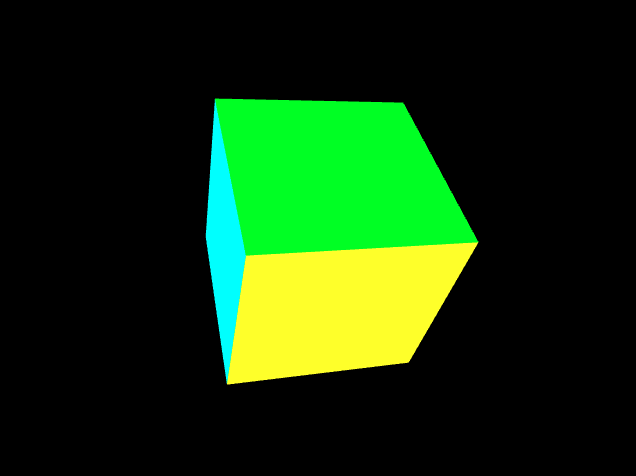

# Web Graphics

Early explorations with WebGL and HTML 5 canvas.   
Each folder is a standalone project which can be viewed by opening the index.html page hosted on a live server.

## Projects

### webgl-basic

A bare-bones animation of a cube using the WebGL api.     

Apart from gl-matrix (for matrix operations), no other supporting libraries are used.   
The vertex, index and color buffers are initialized and loaded to basic vertex and fragment shaders and animated using rotation matrices in the canvas animation frame render loop. 

